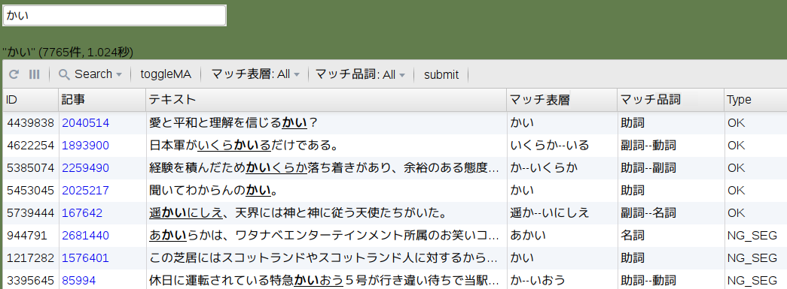

# morant: Morphological Annotation Tool

[](https://circleci.com/gh/FairyDevicesRD/morant)
[](http://goreportcard.com/report/FairyDevicesRD/morant)
[](http://www.apache.org/licenses/LICENSE-2.0)




## Usage

```sh
morant -w /path/to/wikip.db -s=/path/to/system.db --tmp /path/to/mytmp --users users.json --ma=http://localhost:5000 -b 8000
```

With the above command, you can access http://localhost:8000/ with a browser.

### Requires files

- ``wikip.db`` for ``-w`` option
    - Read the [document](wiki2db/README.md) to build it
    - We strongly recommend to put it to ``/dev/shm`` (memory) in order to speed up of looking up
    - [Here](https://github.com/FairyDevicesRD/morant/releases/download/v1/jawiki-20170420.db.xz) is a sample (xz compressed; 1.7GB; Original:9.7GB).
-  ``users.json`` for ``--users`` option
    - User definition file. See ``users.example.json``.

### Optional arguments
See ``morant -h`` for the detail.

- ``-b`` or ``--bind``
    - Port number for the morant
- ``--ma``
    - The address of ``macomp-server``


### Tips.

- ``system.db`` is where the user annotation is stored
- You can graceful restart by using ``kill -USR2 <PID>``
- Sessions are stored a directory under the temporary directory


## Install

### Golang

morant requires [golang](https://golang.org/).

```sh
sudo apt-get install golang
echo 'export GOPATH=~/.go; export PATH=$PATH:$GOPATH/bin' >> ~/.bashrc
soruce ~/.bashrc
```


### morant

```sh
go get github.com/mattn/go-sqlite3
go install github.com/mattn/go-sqlite3
go get github.com/FairyDevicesRD/morant/cmd/morant
```


## Dump annotated data

```sh
python3 ./sqlite2tsv.py -w /path/to/wikip.db -s /path/to/system.db > data.tsv
```


## References

```bib
@INPROCEEDINGS{hayashibe:2017:SIGNL231,
    author    = {林部祐太},
    title     = {日本語部分形態素アノテーションコーパスの構築},
    booktitle = "情報処理学会第231回自然言語処理研究会",
    year      = "2017",
    pages     = "NL-231-9:1-8",
    publisher = "情報処理学会",
}
```


## For developers

``fresh`` is convenient for developpment.

```sh
go get -u github.com/pressly/fresh
fresh -r --wikipedia=/path/to/wikip.db -r -s=/path/to/system.db -r --tmp=./tmp/out -r --users=/path/to/users.json -p ./cmd/morant
```


## License

- [Apache License 2.0](http://www.apache.org/licenses/LICENSE-2.0) by [Fairy Devices Inc.](http://www.fairydevices.jp/)
